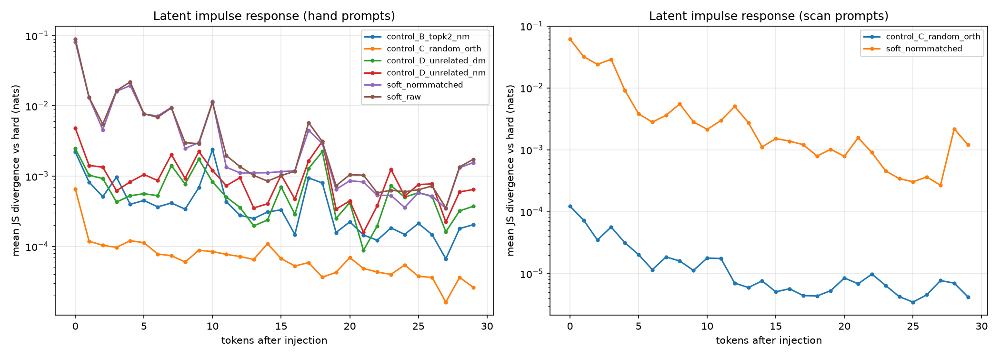

# Dual-Channel Token Recurrence — V1 Report

Working name: "Say Dog, Think Dog/Wolf". This report is descriptive only: it records what happened, with no quality judgements or ranking of continuations.

## 1. Environment

- **model**: `gpt2`
- **seed**: `0`
- **python**: `3.11.15 (main, Mar  3 2026, 09:26:23) [GCC 13.3.0]`
- **platform**: `Linux-6.18.5-fc-v20-x86_64-with-glibc2.39`
- **torch**: `2.13.0+cpu`
- **transformers**: `5.15.1`
- **numpy**: `2.4.6`
- **pandas**: `3.0.5`
- **matplotlib**: `3.11.1`
- **device**: `cpu`
- **decoding**: `greedy argmax (no sampling)`
- **top_k**: `5`
- **free_run_steps**: `40`
- **locked_steps**: `30`
- **beta_control**: `0.3`
- **betas**: `[0.0, 0.05, 0.1, 0.2, 0.3, 0.4, 0.5]`

## 2. Exact algorithm

For each prompt:

1. Run the prompt with `use_cache=True`; take the next-token distribution `p = softmax(logits[:, -1, :])`.
2. The visible token is `y = argmax(p)`. **Every branch displays exactly this token.** The prompt is rerun from scratch for every branch so KV caches are fully independent.
3. Each branch feeds a different *internal* embedding at y's position via `inputs_embeds` + the prompt's `past_key_values`:
   - `hard`: `E[y]`
   - `soft_raw`: `sum_i p_i E[token_i]` over the renormalized top-k
   - `soft_normmatched`: `soft_raw` rescaled to `||E[y]||`
   - `beta_b` / `beta_b_nm`: `(1-b) E[y] + b E[z]` (z = top-2), raw and norm-matched
   - `control_B_topk2_nm`: norm-matched top1/top2 mixture at beta = 0.3
   - `control_C_random_orth`: `E[y]` + random perturbation orthogonal to `E[y]`, with the same L2 distance from `E[y]` as control B (its norm therefore differs slightly from `||E[y]||`; logged per prompt below)
   - `control_D_unrelated_nm`: norm-matched mixture of `E[y]` with an unrelated token at the same beta (its L2 displacement from `E[y]` is generally larger than control B's, since norm-matching does not equalize displacement)
   - `control_D_unrelated_dm`: displacement toward the unrelated token with exactly control B's L2 distance from `E[y]` — the distance-matched comparison for semantic vs unrelated direction
4. **Free run** (Experiments 1–2): after the single injection, each branch returns to ordinary greedy hard-token decoding for 40 steps.
5. **Locked-visible run** (Experiments 3–4): after injection, the hard branch's argmax token is fed identically to all branches for 30 steps, so visible text never diverges; per-step JS/KL/top-10-overlap between each branch's next-token distribution and the hard branch's are recorded.

Decoding is greedy argmax throughout; no sampling; `model.eval()` with `torch.no_grad()`; no weights modified.

## 3. Sanity check: input_ids vs inputs_embeds

Feeding token `y` through `input_ids` and feeding exactly `E[y]` through `inputs_embeds` must produce (near-)identical logits.

| prompt | visible token | max abs logit diff | argmax equal |
|---|---|---|---|
| Although it resembled a wolf, genetic testing showed that th… | ` wolf` | 0 | True |
| The animal slept beside the fireplace, barked at strangers, … | ` strange` | 0 | True |
| The creature had the build of a wolf but generations of dome… | ` wolf` | 0 | True |

## 4. Free-run continuations (all hand-written prompts, unfiltered)

### Prompt: `Although it resembled a wolf, genetic testing showed that the domesticated animal was a`

Top-k at branch point: ` wolf` 0.083, ` hybrid` 0.028, ` very` 0.027, ` "` 0.016, ` member` 0.015
Visible token in every branch: ` wolf`

- **hard**: `.

The researchers also found that the wolf's DNA was more closely related to the domesticated animal than to the wolf's.

"The wolf's DNA is more closely related to the`
- **soft_raw**: `.

The researchers also found that the wolf's DNA was more closely related to the wolf's than to the wolf's DNA.

"The wolf's DNA is more closely related to the`
- **soft_normmatched**: `.

"We are very excited about this discovery," said Dr. David L. L. Loh, a professor of animal behavior at the University of California, San Diego. "It is`

Dose response (visible token identical for every beta):

| beta | variant | first token differing from beta=0 | continuation |
|---|---|---|---|
| 0.00 | raw | — | `.  The researchers also found that the wolf's DNA was more closely related to the domesticated animal than to the wolf's.  "The wolf's DNA is more closely related to the` |
| 0.00 | norm-matched | — | `.  The researchers also found that the wolf's DNA was more closely related to the domesticated animal than to the wolf's.  "The wolf's DNA is more closely related to the` |
| 0.05 | raw | — | `.  The researchers also found that the wolf's DNA was more closely related to the domesticated animal than to the wolf's.  "The wolf's DNA is more closely related to the` |
| 0.05 | norm-matched | — | `.  The researchers also found that the wolf's DNA was more closely related to the domesticated animal than to the wolf's.  "The wolf's DNA is more closely related to the` |
| 0.10 | raw | — | `.  The researchers also found that the wolf's DNA was more closely related to the domesticated animal than to the wolf's.  "The wolf's DNA is more closely related to the` |
| 0.10 | norm-matched | — | `.  The researchers also found that the wolf's DNA was more closely related to the domesticated animal than to the wolf's.  "The wolf's DNA is more closely related to the` |
| 0.20 | raw | — | `.  The researchers also found that the wolf's DNA was more closely related to the domesticated animal than to the wolf's.  "The wolf's DNA is more closely related to the` |
| 0.20 | norm-matched | — | `.  The researchers also found that the wolf's DNA was more closely related to the domesticated animal than to the wolf's.  "The wolf's DNA is more closely related to the` |
| 0.30 | raw | — | `.  The researchers also found that the wolf's DNA was more closely related to the domesticated animal than to the wolf's.  "The wolf's DNA is more closely related to the` |
| 0.30 | norm-matched | — | `.  The researchers also found that the wolf's DNA was more closely related to the domesticated animal than to the wolf's.  "The wolf's DNA is more closely related to the` |
| 0.40 | raw | — | `.  The researchers also found that the wolf's DNA was more closely related to the domesticated animal than to the wolf's.  "The wolf's DNA is more closely related to the` |
| 0.40 | norm-matched | — | `.  The researchers also found that the wolf's DNA was more closely related to the domesticated animal than to the wolf's.  "The wolf's DNA is more closely related to the` |
| 0.50 | raw | — | `.  The researchers also found that the wolf's DNA was more closely related to the domesticated animal than to the wolf's.  "The wolf's DNA is more closely related to the` |
| 0.50 | norm-matched | 3 | `.  "We are very excited about this discovery," said Dr. David L. L. Loh, a professor of animal behavior at the University of California, San Diego. "It is` |

### Prompt: `The animal slept beside the fireplace, barked at strangers, and followed its owner everywhere. It was a`

Top-k at branch point: ` strange` 0.025, ` very` 0.024, ` good` 0.018, ` beautiful` 0.015, ` small` 0.014
Visible token in every branch: ` strange`

- **hard**: ` creature, but it was not a creature that was afraid of humans. It was a creature that was afraid of humans.

"I'm sorry, but I'm not going to let you go`
- **soft_raw**: ` creature, but it was not a good one.

"I'm sorry, but I'm not going to let you go," she said.

"I'm sorry, but I'm`
- **soft_normmatched**: ` creature, but it was not a good one.

"I'm sorry, but I'm not going to let you go," she said.

"I'm sorry, but I'm`

Dose response (visible token identical for every beta):

| beta | variant | first token differing from beta=0 | continuation |
|---|---|---|---|
| 0.00 | raw | — | ` creature, but it was not a creature that was afraid of humans. It was a creature that was afraid of humans.  "I'm sorry, but I'm not going to let you go` |
| 0.00 | norm-matched | — | ` creature, but it was not a creature that was afraid of humans. It was a creature that was afraid of humans.  "I'm sorry, but I'm not going to let you go` |
| 0.05 | raw | — | ` creature, but it was not a creature that was afraid of humans. It was a creature that was afraid of humans.  "I'm sorry, but I'm not going to let you go` |
| 0.05 | norm-matched | — | ` creature, but it was not a creature that was afraid of humans. It was a creature that was afraid of humans.  "I'm sorry, but I'm not going to let you go` |
| 0.10 | raw | 7 | ` creature, but it was not a bad one. It was a good-natured, friendly, and friendly animal. It was a good-natured, friendly, and friendly animal. It was` |
| 0.10 | norm-matched | — | ` creature, but it was not a creature that was afraid of humans. It was a creature that was afraid of humans.  "I'm sorry, but I'm not going to let you go` |
| 0.20 | raw | 7 | ` creature, but it was not a bad one. It was a good-natured, friendly, and friendly animal. It was a good-natured, friendly, and friendly animal. It was` |
| 0.20 | norm-matched | 7 | ` creature, but it was not a bad one. It was a good-natured, friendly, and friendly animal. It was a good-natured, friendly, and friendly animal. It was` |
| 0.30 | raw | 7 | ` creature, but it was not a bad one. It was a very good one.  "I'm sorry, but I'm not going to let you go," she said. "I'm` |
| 0.30 | norm-matched | 7 | ` creature, but it was not a bad one. It was a very good one.  "I'm sorry, but I'm not going to let you go," she said. "I'm` |
| 0.40 | raw | 7 | ` creature, but it was not a bad one. It was a very good one.  "I'm sorry, but I'm not going to let you go," she said. "I'm` |
| 0.40 | norm-matched | 2 | ` creature, and it was not a good one.  "I'm sorry, but I'm not going to let you go," she said.  "I'm sorry, but I'm` |
| 0.50 | raw | 2 | ` creature, and it was very curious.  "I'm not sure what you're talking about," said the animal. "I'm not sure what you're talking about."  "I` |
| 0.50 | norm-matched | 2 | ` creature, and it was very curious.  "I'm not sure what you're talking about," said the animal. "I'm not sure what you're talking about."  "I` |

### Prompt: `The creature had the build of a wolf but generations of domestication had made it a`

Top-k at branch point: ` wolf` 0.068, ` beast` 0.026, ` more` 0.025, ` fearsome` 0.022, ` formidable` 0.019
Visible token in every branch: ` wolf`

- **hard**: `.

"I'm not sure what you're talking about," said the man. "I'm not sure what you're talking about."

"I'm not sure what you're talking`
- **soft_raw**: `.

"I'm not sure what you're talking about," said the man. "I'm not sure what you're talking about."

"I'm not sure what you're talking`
- **soft_normmatched**: `.

"I'm not sure what you're talking about," said the man. "I'm not sure what you're talking about."

"I'm not sure what you're talking`

Dose response (visible token identical for every beta):

| beta | variant | first token differing from beta=0 | continuation |
|---|---|---|---|
| 0.00 | raw | — | `.  "I'm not sure what you're talking about," said the man. "I'm not sure what you're talking about."  "I'm not sure what you're talking` |
| 0.00 | norm-matched | — | `.  "I'm not sure what you're talking about," said the man. "I'm not sure what you're talking about."  "I'm not sure what you're talking` |
| 0.05 | raw | — | `.  "I'm not sure what you're talking about," said the man. "I'm not sure what you're talking about."  "I'm not sure what you're talking` |
| 0.05 | norm-matched | — | `.  "I'm not sure what you're talking about," said the man. "I'm not sure what you're talking about."  "I'm not sure what you're talking` |
| 0.10 | raw | — | `.  "I'm not sure what you're talking about," said the man. "I'm not sure what you're talking about."  "I'm not sure what you're talking` |
| 0.10 | norm-matched | — | `.  "I'm not sure what you're talking about," said the man. "I'm not sure what you're talking about."  "I'm not sure what you're talking` |
| 0.20 | raw | — | `.  "I'm not sure what you're talking about," said the man. "I'm not sure what you're talking about."  "I'm not sure what you're talking` |
| 0.20 | norm-matched | — | `.  "I'm not sure what you're talking about," said the man. "I'm not sure what you're talking about."  "I'm not sure what you're talking` |
| 0.30 | raw | — | `.  "I'm not sure what you're talking about," said the man. "I'm not sure what you're talking about."  "I'm not sure what you're talking` |
| 0.30 | norm-matched | — | `.  "I'm not sure what you're talking about," said the man. "I'm not sure what you're talking about."  "I'm not sure what you're talking` |
| 0.40 | raw | — | `.  "I'm not sure what you're talking about," said the man. "I'm not sure what you're talking about."  "I'm not sure what you're talking` |
| 0.40 | norm-matched | — | `.  "I'm not sure what you're talking about," said the man. "I'm not sure what you're talking about."  "I'm not sure what you're talking` |
| 0.50 | raw | — | `.  "I'm not sure what you're talking about," said the man. "I'm not sure what you're talking about."  "I'm not sure what you're talking` |
| 0.50 | norm-matched | — | `.  "I'm not sure what you're talking about," said the man. "I'm not sure what you're talking about."  "I'm not sure what you're talking` |

### Prompt: `The capital of Australia is`

Top-k at branch point: ` the` 0.090, ` a` 0.052, ` home` 0.042, ` now` 0.031, ` in` 0.026
Visible token in every branch: ` the`

- **hard**: ` world's largest producer of coal, and the country's largest coal-fired power station.

The coal industry is also the world's largest producer of natural gas, and the world's largest producer`
- **soft_raw**: ` world's largest producer of coal, and the country's largest coal-fired power station.

The coal industry is also the world's largest producer of natural gas, and the world's largest producer`
- **soft_normmatched**: ` world's largest producer of coal, and the country's largest coal-fired power station.

The coal industry is also the world's largest producer of natural gas, and the world's largest producer`

Dose response (visible token identical for every beta):

| beta | variant | first token differing from beta=0 | continuation |
|---|---|---|---|
| 0.00 | raw | — | ` world's largest producer of coal, and the country's largest coal-fired power station.  The coal industry is also the world's largest producer of natural gas, and the world's largest producer` |
| 0.00 | norm-matched | — | ` world's largest producer of coal, and the country's largest coal-fired power station.  The coal industry is also the world's largest producer of natural gas, and the world's largest producer` |
| 0.05 | raw | — | ` world's largest producer of coal, and the country's largest coal-fired power station.  The coal industry is also the world's largest producer of natural gas, and the world's largest producer` |
| 0.05 | norm-matched | — | ` world's largest producer of coal, and the country's largest coal-fired power station.  The coal industry is also the world's largest producer of natural gas, and the world's largest producer` |
| 0.10 | raw | — | ` world's largest producer of coal, and the country's largest coal-fired power station.  The coal industry is also the world's largest producer of natural gas, and the world's largest producer` |
| 0.10 | norm-matched | — | ` world's largest producer of coal, and the country's largest coal-fired power station.  The coal industry is also the world's largest producer of natural gas, and the world's largest producer` |
| 0.20 | raw | — | ` world's largest producer of coal, and the country's largest coal-fired power station.  The coal industry is also the world's largest producer of natural gas, and the world's largest producer` |
| 0.20 | norm-matched | — | ` world's largest producer of coal, and the country's largest coal-fired power station.  The coal industry is also the world's largest producer of natural gas, and the world's largest producer` |
| 0.30 | raw | — | ` world's largest producer of coal, and the country's largest coal-fired power station.  The coal industry is also the world's largest producer of natural gas, and the world's largest producer` |
| 0.30 | norm-matched | — | ` world's largest producer of coal, and the country's largest coal-fired power station.  The coal industry is also the world's largest producer of natural gas, and the world's largest producer` |
| 0.40 | raw | — | ` world's largest producer of coal, and the country's largest coal-fired power station.  The coal industry is also the world's largest producer of natural gas, and the world's largest producer` |
| 0.40 | norm-matched | — | ` world's largest producer of coal, and the country's largest coal-fired power station.  The coal industry is also the world's largest producer of natural gas, and the world's largest producer` |
| 0.50 | raw | 0 | ` capital of the world, and the capital of the world is the capital of Australia.  The capital of Australia is the capital of Australia.  The capital of Australia is the capital of Australia` |
| 0.50 | norm-matched | 0 | ` capital of the world, and the capital of the world is the capital of Australia.  The capital of Australia is the capital of Australia.  The capital of Australia is the capital of Australia` |

### Prompt: `After years of study she finally qualified as a`

Top-k at branch point: ` doctor` 0.052, ` physician` 0.024, ` nurse` 0.023, ` "` 0.018, ` psychologist` 0.015
Visible token in every branch: ` doctor`

- **hard**: ` in 2012.

"I was very happy with my results," she said. "I was able to get a job and I was able to get a job. I was able to get a`
- **soft_raw**: ` in 2008.

"I was very happy with my results," she said. "I was able to get a job and I was able to get a job. I was able to get a`
- **soft_normmatched**: ` in 2009.

"I was very happy with my results," she said. "I was able to get a job and I was able to get a job. I was able to get a`

Dose response (visible token identical for every beta):

| beta | variant | first token differing from beta=0 | continuation |
|---|---|---|---|
| 0.00 | raw | — | ` in 2012.  "I was very happy with my results," she said. "I was able to get a job and I was able to get a job. I was able to get a` |
| 0.00 | norm-matched | — | ` in 2012.  "I was very happy with my results," she said. "I was able to get a job and I was able to get a job. I was able to get a` |
| 0.05 | raw | — | ` in 2012.  "I was very happy with my results," she said. "I was able to get a job and I was able to get a job. I was able to get a` |
| 0.05 | norm-matched | — | ` in 2012.  "I was very happy with my results," she said. "I was able to get a job and I was able to get a job. I was able to get a` |
| 0.10 | raw | — | ` in 2012.  "I was very happy with my results," she said. "I was able to get a job and I was able to get a job. I was able to get a` |
| 0.10 | norm-matched | — | ` in 2012.  "I was very happy with my results," she said. "I was able to get a job and I was able to get a job. I was able to get a` |
| 0.20 | raw | — | ` in 2012.  "I was very happy with my results," she said. "I was able to get a job and I was able to get a job. I was able to get a` |
| 0.20 | norm-matched | 24 | ` in 2012.  "I was very happy with my results," she said. "I was able to get a good job and I was able to get a good job. I was able to` |
| 0.30 | raw | 1 | ` in 2009.  "I was very happy with my results," she said. "I was able to get a job and I was able to get a job. I was able to get a` |
| 0.30 | norm-matched | 24 | ` in 2012.  "I was very happy with my results," she said. "I was able to get a good job and I was able to get a good job. I was able to` |
| 0.40 | raw | 1 | ` in 2009.  "I was very happy with my results," she said. "I was able to get a good job and I was able to get a good job. I was able to` |
| 0.40 | norm-matched | 1 | ` in 2009.  "I was very happy with my results," she said. "I was able to get a good job and I was able to get a good job. I was able to` |
| 0.50 | raw | 1 | ` in 2009.  "I was very happy with my results," she said. "I was able to get a good job and I was able to get a good job. I was able to` |
| 0.50 | norm-matched | 1 | ` in 2009.  "I was very happy with my results," she said. "I was able to get a good job and I was able to get a good job. I was able to` |

### Prompt: `The traffic light turned from red to`

Top-k at branch point: ` green` 0.364, ` blue` 0.229, ` yellow` 0.145, ` orange` 0.046, ` white` 0.036
Visible token in every branch: ` green`

- **hard**: `, and the car was stopped.

"I was just trying to get out of the car," said the driver, who asked not to be identified. "I was just trying to get out`
- **soft_raw**: `, and the car was stopped.

"I was just trying to get out of the car," said the driver, who asked not to be identified. "I was just trying to get out`
- **soft_normmatched**: `, and the car was stopped.

"I was just trying to get out of the car," said the driver, who asked not to be identified. "I was just trying to get out`

Dose response (visible token identical for every beta):

| beta | variant | first token differing from beta=0 | continuation |
|---|---|---|---|
| 0.00 | raw | — | `, and the car was stopped.  "I was just trying to get out of the car," said the driver, who asked not to be identified. "I was just trying to get out` |
| 0.00 | norm-matched | — | `, and the car was stopped.  "I was just trying to get out of the car," said the driver, who asked not to be identified. "I was just trying to get out` |
| 0.05 | raw | — | `, and the car was stopped.  "I was just trying to get out of the car," said the driver, who asked not to be identified. "I was just trying to get out` |
| 0.05 | norm-matched | — | `, and the car was stopped.  "I was just trying to get out of the car," said the driver, who asked not to be identified. "I was just trying to get out` |
| 0.10 | raw | — | `, and the car was stopped.  "I was just trying to get out of the car," said the driver, who asked not to be identified. "I was just trying to get out` |
| 0.10 | norm-matched | — | `, and the car was stopped.  "I was just trying to get out of the car," said the driver, who asked not to be identified. "I was just trying to get out` |
| 0.20 | raw | — | `, and the car was stopped.  "I was just trying to get out of the car," said the driver, who asked not to be identified. "I was just trying to get out` |
| 0.20 | norm-matched | — | `, and the car was stopped.  "I was just trying to get out of the car," said the driver, who asked not to be identified. "I was just trying to get out` |
| 0.30 | raw | — | `, and the car was stopped.  "I was just trying to get out of the car," said the driver, who asked not to be identified. "I was just trying to get out` |
| 0.30 | norm-matched | — | `, and the car was stopped.  "I was just trying to get out of the car," said the driver, who asked not to be identified. "I was just trying to get out` |
| 0.40 | raw | — | `, and the car was stopped.  "I was just trying to get out of the car," said the driver, who asked not to be identified. "I was just trying to get out` |
| 0.40 | norm-matched | — | `, and the car was stopped.  "I was just trying to get out of the car," said the driver, who asked not to be identified. "I was just trying to get out` |
| 0.50 | raw | — | `, and the car was stopped.  "I was just trying to get out of the car," said the driver, who asked not to be identified. "I was just trying to get out` |
| 0.50 | norm-matched | — | `, and the car was stopped.  "I was just trying to get out of the car," said the driver, who asked not to be identified. "I was just trying to get out` |

### Prompt: `To drive the nail into the board, he reached for his`

Top-k at branch point: ` gun` 0.039, ` knife` 0.035, ` wallet` 0.019, ` pocket` 0.019, ` hand` 0.016
Visible token in every branch: ` gun`

- **hard**: ` and fired.

"I was just trying to get my hands on it," he said. "I was just trying to get my hands on it."

The bullet hit the back of`
- **soft_raw**: ` and pulled it out.

"I'm not going to let you get away with that," he said.

The officer then pulled out his gun and fired.

"I'm`
- **soft_normmatched**: ` and pulled it out.

"I'm not going to let you get away with it," he said.

The officer then pulled out a gun and shot him in the head.
`

Dose response (visible token identical for every beta):

| beta | variant | first token differing from beta=0 | continuation |
|---|---|---|---|
| 0.00 | raw | — | ` and fired.  "I was just trying to get my hands on it," he said. "I was just trying to get my hands on it."  The bullet hit the back of` |
| 0.00 | norm-matched | — | ` and fired.  "I was just trying to get my hands on it," he said. "I was just trying to get my hands on it."  The bullet hit the back of` |
| 0.05 | raw | — | ` and fired.  "I was just trying to get my hands on it," he said. "I was just trying to get my hands on it."  The bullet hit the back of` |
| 0.05 | norm-matched | — | ` and fired.  "I was just trying to get my hands on it," he said. "I was just trying to get my hands on it."  The bullet hit the back of` |
| 0.10 | raw | — | ` and fired.  "I was just trying to get my hands on it," he said. "I was just trying to get my hands on it."  The bullet hit the back of` |
| 0.10 | norm-matched | — | ` and fired.  "I was just trying to get my hands on it," he said. "I was just trying to get my hands on it."  The bullet hit the back of` |
| 0.20 | raw | — | ` and fired.  "I was just trying to get my hands on it," he said. "I was just trying to get my hands on it."  The bullet hit the back of` |
| 0.20 | norm-matched | — | ` and fired.  "I was just trying to get my hands on it," he said. "I was just trying to get my hands on it."  The bullet hit the back of` |
| 0.30 | raw | 14 | ` and fired.  "I was just trying to get my hands off of him," he said. "I was just trying to get my hands off of him."  The officer fired three` |
| 0.30 | norm-matched | 14 | ` and fired.  "I was just trying to get my hands off of him," he said. "I was just trying to get my hands off of him."  The officer fired three` |
| 0.40 | raw | 14 | ` and fired.  "I was just trying to get my hands off of him," he said. "I was just trying to get my hands off of him."  The officer fired three` |
| 0.40 | norm-matched | 14 | ` and fired.  "I was just trying to get my hands off of him," he said. "I was just trying to get my hands off of him."  The officer fired three` |
| 0.50 | raw | 14 | ` and fired.  "I was just trying to get my hands off of him," he said. "I was just trying to get my hands off of him."  The officer fired three` |
| 0.50 | norm-matched | 14 | ` and fired.  "I was just trying to get my hands off of him," he said. "I was just trying to get my hands off of him."  The officer fired three` |

### Prompt: `Water is made of hydrogen and`

Top-k at branch point: ` oxygen` 0.464, ` helium` 0.279, ` carbon` 0.034, ` methane` 0.019, ` is` 0.010
Visible token in every branch: ` oxygen`

- **hard**: `. The hydrogen is made from the oxygen and the oxygen is made from the hydrogen and the oxygen is made from the hydrogen and the oxygen is made from the hydrogen and the oxygen is made from the hydrogen`
- **soft_raw**: `. The hydrogen is heated by the sun and the oxygen is released by the wind. The wind is the source of the hydrogen.

The sun is the source of the oxygen. The wind is`
- **soft_normmatched**: `. The hydrogen is heated by the sun and the oxygen is released by the wind. The wind is the source of the hydrogen.

The sun is the source of the hydrogen. The wind is`

Dose response (visible token identical for every beta):

| beta | variant | first token differing from beta=0 | continuation |
|---|---|---|---|
| 0.00 | raw | — | `. The hydrogen is made from the oxygen and the oxygen is made from the hydrogen and the oxygen is made from the hydrogen and the oxygen is made from the hydrogen and the oxygen is made from the hydrogen` |
| 0.00 | norm-matched | — | `. The hydrogen is made from the oxygen and the oxygen is made from the hydrogen and the oxygen is made from the hydrogen and the oxygen is made from the hydrogen and the oxygen is made from the hydrogen` |
| 0.05 | raw | — | `. The hydrogen is made from the oxygen and the oxygen is made from the hydrogen and the oxygen is made from the hydrogen and the oxygen is made from the hydrogen and the oxygen is made from the hydrogen` |
| 0.05 | norm-matched | — | `. The hydrogen is made from the oxygen and the oxygen is made from the hydrogen and the oxygen is made from the hydrogen and the oxygen is made from the hydrogen and the oxygen is made from the hydrogen` |
| 0.10 | raw | — | `. The hydrogen is made from the oxygen and the oxygen is made from the hydrogen and the oxygen is made from the hydrogen and the oxygen is made from the hydrogen and the oxygen is made from the hydrogen` |
| 0.10 | norm-matched | — | `. The hydrogen is made from the oxygen and the oxygen is made from the hydrogen and the oxygen is made from the hydrogen and the oxygen is made from the hydrogen and the oxygen is made from the hydrogen` |
| 0.20 | raw | 4 | `. The hydrogen is heated by the sun and the oxygen is released by the wind. The wind is the source of the hydrogen.  The sun is the source of the oxygen. The wind is` |
| 0.20 | norm-matched | — | `. The hydrogen is made from the oxygen and the oxygen is made from the hydrogen and the oxygen is made from the hydrogen and the oxygen is made from the hydrogen and the oxygen is made from the hydrogen` |
| 0.30 | raw | 4 | `. The hydrogen is heated by the sun and the oxygen is released by the wind. The wind is the source of the hydrogen.  The sun is the source of the oxygen. The wind is` |
| 0.30 | norm-matched | 4 | `. The hydrogen is heated by the sun and the oxygen is released by the wind. The wind is the source of the hydrogen.  The sun is the source of the hydrogen. The wind is` |
| 0.40 | raw | 4 | `. The hydrogen is heated by the sun and the oxygen is released by the wind. The wind is the source of the hydrogen.  The sun is the source of the oxygen. The wind is` |
| 0.40 | norm-matched | 4 | `. The hydrogen is heated by the sun and the oxygen is released by the wind. The wind is the source of the hydrogen.  The sun is the source of the hydrogen. The wind is` |
| 0.50 | raw | 4 | `. The hydrogen is heated by the sun and the oxygen is released by the wind. The wind is the source of the hydrogen.  The sun is the source of the oxygen. The wind is` |
| 0.50 | norm-matched | 4 | `. The hydrogen is heated by the sun and the oxygen is released by the wind. The wind is the source of the hydrogen.  The sun is the source of the hydrogen. The wind is` |

### Prompt: `When his flight was cancelled he felt a deep sense of`

Top-k at branch point: ` loss` 0.110, ` relief` 0.088, ` guilt` 0.051, ` responsibility` 0.034, ` shame` 0.029
Visible token in every branch: ` loss`

- **hard**: `. He was so close to his wife that he could not even see her face. He was so close to his wife that he could not even see her face. He was so close to his wife`
- **soft_raw**: ` and sadness.

"I was so scared," he said. "I was so scared to go home. I was so scared to go to school. I was so scared to go to work`
- **soft_normmatched**: ` and a sense of loss. He was in a very difficult situation. He was in a very difficult situation. He was in a very difficult situation. He was in a very difficult situation. He was`

Dose response (visible token identical for every beta):

| beta | variant | first token differing from beta=0 | continuation |
|---|---|---|---|
| 0.00 | raw | — | `. He was so close to his wife that he could not even see her face. He was so close to his wife that he could not even see her face. He was so close to his wife` |
| 0.00 | norm-matched | — | `. He was so close to his wife that he could not even see her face. He was so close to his wife that he could not even see her face. He was so close to his wife` |
| 0.05 | raw | — | `. He was so close to his wife that he could not even see her face. He was so close to his wife that he could not even see her face. He was so close to his wife` |
| 0.05 | norm-matched | — | `. He was so close to his wife that he could not even see her face. He was so close to his wife that he could not even see her face. He was so close to his wife` |
| 0.10 | raw | — | `. He was so close to his wife that he could not even see her face. He was so close to his wife that he could not even see her face. He was so close to his wife` |
| 0.10 | norm-matched | 1 | `.  "I was so scared," he said. "I was so scared to go home. I was so scared to go to school. I was so scared to go to work. I` |
| 0.20 | raw | 1 | `.  "I was so scared," he said. "I was so scared to go home. I was so scared to go to school. I was so scared to go to work. I` |
| 0.20 | norm-matched | 1 | `.  "I was so scared," he said. "I was so scared to go home. I was so scared to go to school. I was so scared to go to work. I` |
| 0.30 | raw | 1 | `.  "I was so scared," he said. "I was so scared to go home. I was so scared to go to school. I was so scared to go to work. I` |
| 0.30 | norm-matched | 1 | `.  "I was so scared," he said. "I was so scared to go home. I was so scared to go to school. I was so scared to go to work. I` |
| 0.40 | raw | 1 | `.  "I was so scared," he said. "I was so scared to go home. I was so scared to go to school. I was so scared to go to work. I` |
| 0.40 | norm-matched | 1 | `.  "I was so scared," he said. "I was so scared to go home. I was so scared to go to school. I was so scared to go to work. I` |
| 0.50 | raw | 1 | `.  "I was so happy to be back home," he said. "I was so happy to be back home. I was so happy to be back home. I was so happy to` |
| 0.50 | norm-matched | 1 | `.  "I was so happy to be back home," he said. "I was so happy to be back home. I was so happy to be back home. I was so happy to` |

### Prompt: `The defendant was charged with a serious`

Top-k at branch point: ` felony` 0.146, ` misdemeanor` 0.093, ` assault` 0.070, ` crime` 0.060, ` offense` 0.059
Visible token in every branch: ` felony`

- **hard**: `, a misdemeanor, and was sentenced to a term of imprisonment of not more than five years.

The defendant was also charged with a felony, a misdemeanor, and was sentenced to a term of`
- **soft_raw**: ` of aggravated assault with a deadly weapon, a felony punishable by up to five years in prison and a fine of up to $1,000.

The defendant was also charged with a felony of`
- **soft_normmatched**: ` of aggravated assault with a deadly weapon, a felony of aggravated assault with a deadly weapon, and a felony of aggravated assault with a deadly weapon.

The defendant was charged with a felony of aggravated`

Dose response (visible token identical for every beta):

| beta | variant | first token differing from beta=0 | continuation |
|---|---|---|---|
| 0.00 | raw | — | `, a misdemeanor, and was sentenced to a term of imprisonment of not more than five years.  The defendant was also charged with a felony, a misdemeanor, and was sentenced to a term of` |
| 0.00 | norm-matched | — | `, a misdemeanor, and was sentenced to a term of imprisonment of not more than five years.  The defendant was also charged with a felony, a misdemeanor, and was sentenced to a term of` |
| 0.05 | raw | — | `, a misdemeanor, and was sentenced to a term of imprisonment of not more than five years.  The defendant was also charged with a felony, a misdemeanor, and was sentenced to a term of` |
| 0.05 | norm-matched | — | `, a misdemeanor, and was sentenced to a term of imprisonment of not more than five years.  The defendant was also charged with a felony, a misdemeanor, and was sentenced to a term of` |
| 0.10 | raw | — | `, a misdemeanor, and was sentenced to a term of imprisonment of not more than five years.  The defendant was also charged with a felony, a misdemeanor, and was sentenced to a term of` |
| 0.10 | norm-matched | — | `, a misdemeanor, and was sentenced to a term of imprisonment of not more than five years.  The defendant was also charged with a felony, a misdemeanor, and was sentenced to a term of` |
| 0.20 | raw | 5 | `, a misdemeanor, and a felony of aggravated assault with a deadly weapon.  The defendant was also charged with a felony of aggravated assault with a deadly weapon.  The defendant was also charged` |
| 0.20 | norm-matched | 5 | `, a misdemeanor, and a felony of aggravated assault with a deadly weapon.  The defendant was also charged with a felony of aggravated assault with a deadly weapon.  The defendant was also charged` |
| 0.30 | raw | 5 | `, a misdemeanor, and a felony of aggravated assault with a deadly weapon.  The defendant was also charged with a felony of aggravated assault with a deadly weapon.  The defendant was also charged` |
| 0.30 | norm-matched | 5 | `, a misdemeanor, and a felony of aggravated assault with a deadly weapon.  The defendant was also charged with a felony of aggravated assault with a deadly weapon.  The defendant was also charged` |
| 0.40 | raw | 5 | `, a misdemeanor, and a felony of aggravated assault with a deadly weapon.  The defendant was also charged with a felony of aggravated assault with a deadly weapon.  The defendant was also charged` |
| 0.40 | norm-matched | 5 | `, a misdemeanor, and a felony of aggravated assault with a deadly weapon.  The defendant was also charged with a felony of aggravated assault with a deadly weapon.  The defendant was also charged` |
| 0.50 | raw | 3 | `, a misdemeanor punishable by up to five years in prison, and was sentenced to a maximum of five years in prison.  The defendant was also charged with a felony, a misdemeanor punishable by up` |
| 0.50 | norm-matched | 3 | `, a misdemeanor punishable by up to five years in prison, and was sentenced to a maximum of five years in prison.  The defendant was also charged with a felony, a misdemeanor punishable by up` |

### Prompt: `Because the bridge was never maintained, it eventually`

Top-k at branch point: ` became` 0.199, ` collapsed` 0.110, ` fell` 0.089, ` was` 0.069, ` went` 0.028
Visible token in every branch: ` became`

- **hard**: ` a major tourist attraction.

The bridge was built in 1885 and was completed in 1887. It was the first bridge in the United States to be built in the United States.

`
- **soft_raw**: ` a part of the city's history.

The bridge was built in 1885, and it was built to serve as a temporary bridge between the city and the surrounding area. It was built to`
- **soft_normmatched**: ` a major tourist attraction.

The bridge was built in 1885 and was completed in 1887. It was the first bridge in the world to be built in the United States.

The`

Dose response (visible token identical for every beta):

| beta | variant | first token differing from beta=0 | continuation |
|---|---|---|---|
| 0.00 | raw | — | ` a major tourist attraction.  The bridge was built in 1885 and was completed in 1887. It was the first bridge in the United States to be built in the United States.  ` |
| 0.00 | norm-matched | — | ` a major tourist attraction.  The bridge was built in 1885 and was completed in 1887. It was the first bridge in the United States to be built in the United States.  ` |
| 0.05 | raw | — | ` a major tourist attraction.  The bridge was built in 1885 and was completed in 1887. It was the first bridge in the United States to be built in the United States.  ` |
| 0.05 | norm-matched | — | ` a major tourist attraction.  The bridge was built in 1885 and was completed in 1887. It was the first bridge in the United States to be built in the United States.  ` |
| 0.10 | raw | — | ` a major tourist attraction.  The bridge was built in 1885 and was completed in 1887. It was the first bridge in the United States to be built in the United States.  ` |
| 0.10 | norm-matched | — | ` a major tourist attraction.  The bridge was built in 1885 and was completed in 1887. It was the first bridge in the United States to be built in the United States.  ` |
| 0.20 | raw | — | ` a major tourist attraction.  The bridge was built in 1885 and was completed in 1887. It was the first bridge in the United States to be built in the United States.  ` |
| 0.20 | norm-matched | — | ` a major tourist attraction.  The bridge was built in 1885 and was completed in 1887. It was the first bridge in the United States to be built in the United States.  ` |
| 0.30 | raw | — | ` a major tourist attraction.  The bridge was built in 1885 and was completed in 1887. It was the first bridge in the United States to be built in the United States.  ` |
| 0.30 | norm-matched | — | ` a major tourist attraction.  The bridge was built in 1885 and was completed in 1887. It was the first bridge in the United States to be built in the United States.  ` |
| 0.40 | raw | 28 | ` a major tourist attraction.  The bridge was built in 1885 and was completed in 1887. It was the first bridge in the world to be built in the United States.  The` |
| 0.40 | norm-matched | 28 | ` a major tourist attraction.  The bridge was built in 1885 and was completed in 1887. It was the first bridge in the world to be built in the United States.  The` |
| 0.50 | raw | 0 | ` into a pile of rubble.  The bridge was built in 1885, and was built to withstand the rigors of the war. It was built to withstand the rigors of the war.` |
| 0.50 | norm-matched | 0 | ` into a pile of rubble.  The bridge was built in 1885, and was built to withstand the rigors of the war. It was built to withstand the rigors of the war.` |

### Prompt: `The largest planet in the solar system is`

Top-k at branch point: ` about` 0.082, ` the` 0.066, ` a` 0.048, ` Saturn` 0.033, ` located` 0.031
Visible token in every branch: ` about`

- **hard**: ` 1.5 billion light-years away.

The planet is about 1.5 billion light-years from Earth.

The planet is about 1.5 billion light-years from Earth`
- **soft_raw**: ` dwarf planet, Titan. It is the largest planet in the solar system, and the largest planet in the solar system, Titan. It is the largest planet in the solar system, and the largest planet`
- **soft_normmatched**: ` dwarf planet, Titan. It is the largest planet in the solar system, and the largest planet in the solar system, Titan. It is the largest planet in the solar system, and the largest planet`

Dose response (visible token identical for every beta):

| beta | variant | first token differing from beta=0 | continuation |
|---|---|---|---|
| 0.00 | raw | — | ` 1.5 billion light-years away.  The planet is about 1.5 billion light-years from Earth.  The planet is about 1.5 billion light-years from Earth` |
| 0.00 | norm-matched | — | ` 1.5 billion light-years away.  The planet is about 1.5 billion light-years from Earth.  The planet is about 1.5 billion light-years from Earth` |
| 0.05 | raw | — | ` 1.5 billion light-years away.  The planet is about 1.5 billion light-years from Earth.  The planet is about 1.5 billion light-years from Earth` |
| 0.05 | norm-matched | — | ` 1.5 billion light-years away.  The planet is about 1.5 billion light-years from Earth.  The planet is about 1.5 billion light-years from Earth` |
| 0.10 | raw | — | ` 1.5 billion light-years away.  The planet is about 1.5 billion light-years from Earth.  The planet is about 1.5 billion light-years from Earth` |
| 0.10 | norm-matched | — | ` 1.5 billion light-years away.  The planet is about 1.5 billion light-years from Earth.  The planet is about 1.5 billion light-years from Earth` |
| 0.20 | raw | — | ` 1.5 billion light-years away.  The planet is about 1.5 billion light-years from Earth.  The planet is about 1.5 billion light-years from Earth` |
| 0.20 | norm-matched | — | ` 1.5 billion light-years away.  The planet is about 1.5 billion light-years from Earth.  The planet is about 1.5 billion light-years from Earth` |
| 0.30 | raw | — | ` 1.5 billion light-years away.  The planet is about 1.5 billion light-years from Earth.  The planet is about 1.5 billion light-years from Earth` |
| 0.30 | norm-matched | — | ` 1.5 billion light-years away.  The planet is about 1.5 billion light-years from Earth.  The planet is about 1.5 billion light-years from Earth` |
| 0.40 | raw | 0 | ` Jupiter, which is about the size of Earth. The planet is about 1.5 billion miles (2.5 billion kilometers) in diameter.  The planet is about 1.5 billion miles` |
| 0.40 | norm-matched | 24 | ` 1.5 billion light-years away.  The planet is about 1.5 billion light-years from Earth, and is about 1.5 billion light-years from the Sun. ` |
| 0.50 | raw | 0 | ` dwarf planet Ceres, which is about the size of Earth.  The dwarf planet Ceres is about the size of Earth.  The dwarf planet Ceres is about the size of Earth.  ` |
| 0.50 | norm-matched | 0 | ` dwarf planet Ceres, which is about the size of Earth.  The dwarf planet Ceres is about the size of Earth.  The dwarf planet Ceres is about the size of Earth.  ` |

### Prompt: `She painted the entire room a bright shade of`

Top-k at branch point: ` red` 0.161, ` blue` 0.132, ` pink` 0.106, ` green` 0.067, ` purple` 0.060
Visible token in every branch: ` red`

- **hard**: `, and the walls were covered with a thick layer of black.

"I'm sorry, but I'm not sure if you're ready to go back to the castle."

"I`
- **soft_raw**: `, and the walls were covered with a layer of white.

"I'm sorry, but I'm not sure if you're ready to go back to the room."

"I'm`
- **soft_normmatched**: `, and the walls were covered with a layer of white.

"I'm sorry, but I'm not sure if you're ready to go back to the room."

"I'm`

Dose response (visible token identical for every beta):

| beta | variant | first token differing from beta=0 | continuation |
|---|---|---|---|
| 0.00 | raw | — | `, and the walls were covered with a thick layer of black.  "I'm sorry, but I'm not sure if you're ready to go back to the castle."  "I` |
| 0.00 | norm-matched | — | `, and the walls were covered with a thick layer of black.  "I'm sorry, but I'm not sure if you're ready to go back to the castle."  "I` |
| 0.05 | raw | — | `, and the walls were covered with a thick layer of black.  "I'm sorry, but I'm not sure if you're ready to go back to the castle."  "I` |
| 0.05 | norm-matched | — | `, and the walls were covered with a thick layer of black.  "I'm sorry, but I'm not sure if you're ready to go back to the castle."  "I` |
| 0.10 | raw | — | `, and the walls were covered with a thick layer of black.  "I'm sorry, but I'm not sure if you're ready to go back to the castle."  "I` |
| 0.10 | norm-matched | — | `, and the walls were covered with a thick layer of black.  "I'm sorry, but I'm not sure if you're ready to go back to the castle."  "I` |
| 0.20 | raw | — | `, and the walls were covered with a thick layer of black.  "I'm sorry, but I'm not sure if you're ready to go back to the castle."  "I` |
| 0.20 | norm-matched | — | `, and the walls were covered with a thick layer of black.  "I'm sorry, but I'm not sure if you're ready to go back to the castle."  "I` |
| 0.30 | raw | — | `, and the walls were covered with a thick layer of black.  "I'm sorry, but I'm not sure if you're ready to go back to the castle."  "I` |
| 0.30 | norm-matched | 8 | `, and the walls were covered with a layer of black.  "I'm sorry, but I'm not sure if you're ready to go back to the room."  "I'm` |
| 0.40 | raw | 8 | `, and the walls were covered with a layer of black.  "I'm sorry, but I'm not sure if you're ready to go back to the room."  "I'm` |
| 0.40 | norm-matched | 8 | `, and the walls were covered with a layer of black.  "I'm sorry, but I'm not sure if you're ready to go back to the room."  "I'm` |
| 0.50 | raw | 8 | `, and the walls were covered with a layer of black.  "I'm sorry, but I'm not sure if you're ready to go back to the room."  "I'm` |
| 0.50 | norm-matched | 8 | `, and the walls were covered with a layer of black.  "I'm sorry, but I'm not sure if you're ready to go back to the room."  "I'm` |

### Prompt: `The patient was rushed to the hospital and treated by a`

Top-k at branch point: ` local` 0.080, ` specialist` 0.079, ` doctor` 0.070, ` team` 0.061, ` nurse` 0.061
Visible token in every branch: ` local`

- **hard**: ` hospital.

The patient was taken to the hospital for treatment of a minor injury.

The patient was taken to the hospital for treatment of a minor injury.

The patient was taken`
- **soft_raw**: ` who was able to identify the patient.

The patient was taken to the hospital for further treatment.

The patient was taken to the hospital for further treatment.

The patient was taken`
- **soft_normmatched**: `.

The patient was taken to the hospital for further treatment.

The patient was taken to the hospital for further treatment.

The patient was taken to the hospital for further treatment.`

Dose response (visible token identical for every beta):

| beta | variant | first token differing from beta=0 | continuation |
|---|---|---|---|
| 0.00 | raw | — | ` hospital.  The patient was taken to the hospital for treatment of a minor injury.  The patient was taken to the hospital for treatment of a minor injury.  The patient was taken` |
| 0.00 | norm-matched | — | ` hospital.  The patient was taken to the hospital for treatment of a minor injury.  The patient was taken to the hospital for treatment of a minor injury.  The patient was taken` |
| 0.05 | raw | — | ` hospital.  The patient was taken to the hospital for treatment of a minor injury.  The patient was taken to the hospital for treatment of a minor injury.  The patient was taken` |
| 0.05 | norm-matched | — | ` hospital.  The patient was taken to the hospital for treatment of a minor injury.  The patient was taken to the hospital for treatment of a minor injury.  The patient was taken` |
| 0.10 | raw | — | ` hospital.  The patient was taken to the hospital for treatment of a minor injury.  The patient was taken to the hospital for treatment of a minor injury.  The patient was taken` |
| 0.10 | norm-matched | — | ` hospital.  The patient was taken to the hospital for treatment of a minor injury.  The patient was taken to the hospital for treatment of a minor injury.  The patient was taken` |
| 0.20 | raw | — | ` hospital.  The patient was taken to the hospital for treatment of a minor injury.  The patient was taken to the hospital for treatment of a minor injury.  The patient was taken` |
| 0.20 | norm-matched | — | ` hospital.  The patient was taken to the hospital for treatment of a minor injury.  The patient was taken to the hospital for treatment of a minor injury.  The patient was taken` |
| 0.30 | raw | — | ` hospital.  The patient was taken to the hospital for treatment of a minor injury.  The patient was taken to the hospital for treatment of a minor injury.  The patient was taken` |
| 0.30 | norm-matched | — | ` hospital.  The patient was taken to the hospital for treatment of a minor injury.  The patient was taken to the hospital for treatment of a minor injury.  The patient was taken` |
| 0.40 | raw | 0 | ` doctor.  The patient was taken to the hospital for further treatment.  The patient was taken to the hospital for further treatment.  The patient was taken to the hospital for further treatment` |
| 0.40 | norm-matched | 0 | ` doctor.  The patient was taken to the hospital for further treatment.  The patient was taken to the hospital for further treatment.  The patient was taken to the hospital for further treatment` |
| 0.50 | raw | 0 | `.  The patient was taken to the hospital for further treatment.  The patient was taken to the hospital for further treatment.  The patient was taken to the hospital for further treatment.` |
| 0.50 | norm-matched | 0 | `.  The patient was taken to the hospital for further treatment.  The patient was taken to the hospital for further treatment.  The patient was taken to the hospital for further treatment.` |

### Prompt: `The opposite of hot is`

Top-k at branch point: ` cold` 0.163, ` the` 0.082, ` a` 0.062, ` hot` 0.040, ` not` 0.038
Visible token in every branch: ` cold`

- **hard**: `.

The coldest part of the world is the coldest part of the world.

The coldest part of the world is the coldest part of the world.

The`
- **soft_raw**: `.

The hot side of hot is cold.

The cold side of cold is cold.

The cold side of cold is cold.

The cold side of cold is cold`
- **soft_normmatched**: `.

The heat of the sun is the heat of the earth.

The heat of the sun is the heat of the earth.

The heat of the sun is the heat of`

Dose response (visible token identical for every beta):

| beta | variant | first token differing from beta=0 | continuation |
|---|---|---|---|
| 0.00 | raw | — | `.  The coldest part of the world is the coldest part of the world.  The coldest part of the world is the coldest part of the world.  The` |
| 0.00 | norm-matched | — | `.  The coldest part of the world is the coldest part of the world.  The coldest part of the world is the coldest part of the world.  The` |
| 0.05 | raw | — | `.  The coldest part of the world is the coldest part of the world.  The coldest part of the world is the coldest part of the world.  The` |
| 0.05 | norm-matched | — | `.  The coldest part of the world is the coldest part of the world.  The coldest part of the world is the coldest part of the world.  The` |
| 0.10 | raw | — | `.  The coldest part of the world is the coldest part of the world.  The coldest part of the world is the coldest part of the world.  The` |
| 0.10 | norm-matched | — | `.  The coldest part of the world is the coldest part of the world.  The coldest part of the world is the coldest part of the world.  The` |
| 0.20 | raw | 6 | `.  The coldest place on Earth is the Arctic Circle, which is about 1,000 miles from the Arctic Circle.  The coldest place on Earth is the Arctic Circle, which` |
| 0.20 | norm-matched | — | `.  The coldest part of the world is the coldest part of the world.  The coldest part of the world is the coldest part of the world.  The` |
| 0.30 | raw | 6 | `.  The coldest place on Earth is the Arctic Circle, which is about 1,000 miles from the Arctic Circle.  The coldest place on Earth is the Arctic Circle, which` |
| 0.30 | norm-matched | 6 | `.  The coldest place on Earth is the Arctic Circle, which is about 1,000 miles from the Arctic Circle.  The coldest place on Earth is the Arctic Circle, which` |
| 0.40 | raw | 4 | `.  The heat of the sun is the heat of the earth.  The heat of the sun is the heat of the earth.  The heat of the sun is the heat of` |
| 0.40 | norm-matched | 4 | `.  The first thing you need to do is to get your hands on a thermometer. It's a small, inexpensive device that can measure temperature in a variety of ways. It's a` |
| 0.50 | raw | 0 | ` cold. The cold is the coldest of all the colds.  The coldest of all the colds. The coldest of all the colds. The coldest of all the` |
| 0.50 | norm-matched | 0 | ` cold. The cold is the coldest of all the colds.  The coldest of all the colds. The coldest of all the colds. The coldest of all the` |

### Prompt: `The chef sliced the vegetables with a sharp`

Top-k at branch point: ` knife` 0.938, ` fork` 0.013, ` blade` 0.010, `-` 0.003, ` sharp` 0.002
Visible token in every branch: ` knife`

- **hard**: ` and then cooked them in the oven for about 30 minutes.

The vegetables were then cooked in a large pot and then cooked in a large saucepan for about 30 minutes.

The vegetables`
- **soft_raw**: ` and then cooked them in the oven for about 30 minutes.

The vegetables were then cooked in a large pot and then cooked in a large saucepan for about 30 minutes.

The vegetables`
- **soft_normmatched**: ` and then cooked them in the oven for about 30 minutes.

The vegetables were then cooked in a large pot and then cooked in a large saucepan for about 30 minutes.

The vegetables`

Dose response (visible token identical for every beta):

| beta | variant | first token differing from beta=0 | continuation |
|---|---|---|---|
| 0.00 | raw | — | ` and then cooked them in the oven for about 30 minutes.  The vegetables were then cooked in a large pot and then cooked in a large saucepan for about 30 minutes.  The vegetables` |
| 0.00 | norm-matched | — | ` and then cooked them in the oven for about 30 minutes.  The vegetables were then cooked in a large pot and then cooked in a large saucepan for about 30 minutes.  The vegetables` |
| 0.05 | raw | 25 | ` and then cooked them in the oven for about 30 minutes.  The vegetables were then cooked in a large pot and then drained and rinsed with water.  The chef then added the` |
| 0.05 | norm-matched | — | ` and then cooked them in the oven for about 30 minutes.  The vegetables were then cooked in a large pot and then cooked in a large saucepan for about 30 minutes.  The vegetables` |
| 0.10 | raw | 25 | ` and then cooked them in the oven for about 30 minutes.  The vegetables were then cooked in a large pot and then drained and rinsed with water.  The chef then added the` |
| 0.10 | norm-matched | 25 | ` and then cooked them in the oven for about 30 minutes.  The vegetables were then cooked in a large pot and then drained and rinsed with water.  The chef then added the` |
| 0.20 | raw | 25 | ` and then cooked them in the oven for about 30 minutes.  The vegetables were then cooked in a large pot and then drained and rinsed with water.  The chef then added the` |
| 0.20 | norm-matched | 25 | ` and then cooked them in the oven for about 30 minutes.  The vegetables were then cooked in a large pot and then drained and rinsed with water.  The chef then added the` |
| 0.30 | raw | 25 | ` and then cooked them in the oven for about 30 minutes.  The vegetables were then cooked in a large pot and then drained and rinsed with water.  The chef then added the` |
| 0.30 | norm-matched | 25 | ` and then cooked them in the oven for about 30 minutes.  The vegetables were then cooked in a large pot and then drained and rinsed with water.  The chef then added the` |
| 0.40 | raw | 25 | ` and then cooked them in the oven for about 30 minutes.  The vegetables were then cooked in a large pot and then drained and rinsed in a colander.  The chef then` |
| 0.40 | norm-matched | 25 | ` and then cooked them in the oven for about 30 minutes.  The vegetables were then cooked in a large pot and then drained and rinsed in a colander.  The chef then` |
| 0.50 | raw | 25 | ` and then cooked them in the oven for about 30 minutes.  The vegetables were then cooked in a large pot and then drained and rinsed in a colander.  The chef then` |
| 0.50 | norm-matched | 25 | ` and then cooked them in the oven for about 30 minutes.  The vegetables were then cooked in a large pot and then drained and rinsed in a colander.  The chef then` |

### Prompt: `The chemical symbol Au stands for`

Top-k at branch point: ` "` 0.184, ` the` 0.051, ` Au` 0.034, ` a` 0.029, ` an` 0.028
Visible token in every branch: ` "`

- **hard**: `antioxidant" and is used to describe the antioxidant properties of the food.

The chemical symbol Au stands for "antioxidant" and is used to describe the antioxidant properties of the food`
- **soft_raw**: `antioxidant" and "antioxidant" is the name of the chemical compound that is responsible for the antioxidant properties of the food.

The chemical symbol Au stands for "antioxidant`
- **soft_normmatched**: `all the elements of the universe."

The chemical symbol Au stands for "all the elements of the universe."

The chemical symbol Au stands for "all the elements of the universe."
`

Dose response (visible token identical for every beta):

| beta | variant | first token differing from beta=0 | continuation |
|---|---|---|---|
| 0.00 | raw | — | `antioxidant" and is used to describe the antioxidant properties of the food.  The chemical symbol Au stands for "antioxidant" and is used to describe the antioxidant properties of the food` |
| 0.00 | norm-matched | — | `antioxidant" and is used to describe the antioxidant properties of the food.  The chemical symbol Au stands for "antioxidant" and is used to describe the antioxidant properties of the food` |
| 0.05 | raw | — | `antioxidant" and is used to describe the antioxidant properties of the food.  The chemical symbol Au stands for "antioxidant" and is used to describe the antioxidant properties of the food` |
| 0.05 | norm-matched | — | `antioxidant" and is used to describe the antioxidant properties of the food.  The chemical symbol Au stands for "antioxidant" and is used to describe the antioxidant properties of the food` |
| 0.10 | raw | — | `antioxidant" and is used to describe the antioxidant properties of the food.  The chemical symbol Au stands for "antioxidant" and is used to describe the antioxidant properties of the food` |
| 0.10 | norm-matched | — | `antioxidant" and is used to describe the antioxidant properties of the food.  The chemical symbol Au stands for "antioxidant" and is used to describe the antioxidant properties of the food` |
| 0.20 | raw | 3 | `antioxidant."  The chemical symbol Au stands for "antioxidant." The chemical symbol Au stands for "antioxidant." The chemical symbol Au stands for "antioxidant." The` |
| 0.20 | norm-matched | — | `antioxidant" and is used to describe the antioxidant properties of the food.  The chemical symbol Au stands for "antioxidant" and is used to describe the antioxidant properties of the food` |
| 0.30 | raw | 0 | `all the elements of the universe."  The chemical symbol Au stands for "all the elements of the universe."  The chemical symbol Au stands for "all the elements of the universe." ` |
| 0.30 | norm-matched | 0 | `all the elements of the universe."  The chemical symbol Au stands for "all the elements of the universe."  The chemical symbol Au stands for "all the elements of the universe." ` |
| 0.40 | raw | 0 | `all-purpose" and is used to indicate the chemical composition of the material.  The chemical symbol Au stands for "all-purpose" and is used to indicate the chemical composition of the material` |
| 0.40 | norm-matched | 0 | `all-purpose" and is used to indicate the chemical composition of the material.  The chemical symbol Au stands for "all-purpose" and is used to indicate the chemical composition of the material` |
| 0.50 | raw | 0 | ` acid, which is the most important element in the chemical makeup of the body. It is the most important element in the body's chemical makeup.  The chemical symbol Au stands for the acid,` |
| 0.50 | norm-matched | 0 | `alpha-tocopherol, which is the most abundant form of the chemical. It is also the most abundant form of the chemical in the human body.  The chemical symbol Au stands for "` |

### Prompt: `Losing the championship filled the team with`

Top-k at branch point: ` a` 0.127, ` confidence` 0.035, ` uncertainty` 0.029, ` some` 0.028, ` optimism` 0.020
Visible token in every branch: ` a`

- **hard**: ` lot of pressure.

"We had to make sure we were ready to go," said coach Mike Krzyzewski. "We had to make sure we were ready to go. We had`
- **soft_raw**: ` lot of pressure.

"We had to make sure we were ready to go," said coach Mike Krzyzewski. "We had to make sure we were ready to go. We had`
- **soft_normmatched**: ` lot of pressure.

"We had to make sure we were ready to go," said coach Mike Krzyzewski. "We had to make sure we were ready to go. We had`

Dose response (visible token identical for every beta):

| beta | variant | first token differing from beta=0 | continuation |
|---|---|---|---|
| 0.00 | raw | — | ` lot of pressure.  "We had to make sure we were ready to go," said coach Mike Krzyzewski. "We had to make sure we were ready to go. We had` |
| 0.00 | norm-matched | — | ` lot of pressure.  "We had to make sure we were ready to go," said coach Mike Krzyzewski. "We had to make sure we were ready to go. We had` |
| 0.05 | raw | — | ` lot of pressure.  "We had to make sure we were ready to go," said coach Mike Krzyzewski. "We had to make sure we were ready to go. We had` |
| 0.05 | norm-matched | — | ` lot of pressure.  "We had to make sure we were ready to go," said coach Mike Krzyzewski. "We had to make sure we were ready to go. We had` |
| 0.10 | raw | — | ` lot of pressure.  "We had to make sure we were ready to go," said coach Mike Krzyzewski. "We had to make sure we were ready to go. We had` |
| 0.10 | norm-matched | — | ` lot of pressure.  "We had to make sure we were ready to go," said coach Mike Krzyzewski. "We had to make sure we were ready to go. We had` |
| 0.20 | raw | — | ` lot of pressure.  "We had to make sure we were ready to go," said coach Mike Krzyzewski. "We had to make sure we were ready to go. We had` |
| 0.20 | norm-matched | — | ` lot of pressure.  "We had to make sure we were ready to go," said coach Mike Krzyzewski. "We had to make sure we were ready to go. We had` |
| 0.30 | raw | — | ` lot of pressure.  "We had to make sure we were ready to go," said coach Mike Krzyzewski. "We had to make sure we were ready to go. We had` |
| 0.30 | norm-matched | — | ` lot of pressure.  "We had to make sure we were ready to go," said coach Mike Krzyzewski. "We had to make sure we were ready to go. We had` |
| 0.40 | raw | — | ` lot of pressure.  "We had to make sure we were ready to go," said coach Mike Krzyzewski. "We had to make sure we were ready to go. We had` |
| 0.40 | norm-matched | — | ` lot of pressure.  "We had to make sure we were ready to go," said coach Mike Krzyzewski. "We had to make sure we were ready to go. We had` |
| 0.50 | raw | — | ` lot of pressure.  "We had to make sure we were ready to go," said coach Mike Krzyzewski. "We had to make sure we were ready to go. We had` |
| 0.50 | norm-matched | 0 | ` sense of urgency.  "We had a lot of work to do," said coach Mike Krzyzewski. "We had to get back to the way we were before we lost the championship` |

### Prompt: `Signing the document made the agreement legally`

Top-k at branch point: ` binding` 0.941, ` enforce` 0.027, ` void` 0.003, ` valid` 0.002, ` invalid` 0.002
Visible token in every branch: ` binding`

- **hard**: `.

The agreement was signed by the two parties on June 30, 2015.

The agreement was signed by the two parties on June 30, 2015.

The agreement was signed by`
- **soft_raw**: `.

The agreement was signed by the two parties on June 30, 2015.

The agreement was signed by the two parties on June 30, 2015.

The agreement was signed by`
- **soft_normmatched**: `.

The agreement was signed by the two parties on June 30, 2015.

The agreement was signed by the two parties on June 30, 2015.

The agreement was signed by`

Dose response (visible token identical for every beta):

| beta | variant | first token differing from beta=0 | continuation |
|---|---|---|---|
| 0.00 | raw | — | `.  The agreement was signed by the two parties on June 30, 2015.  The agreement was signed by the two parties on June 30, 2015.  The agreement was signed by` |
| 0.00 | norm-matched | — | `.  The agreement was signed by the two parties on June 30, 2015.  The agreement was signed by the two parties on June 30, 2015.  The agreement was signed by` |
| 0.05 | raw | — | `.  The agreement was signed by the two parties on June 30, 2015.  The agreement was signed by the two parties on June 30, 2015.  The agreement was signed by` |
| 0.05 | norm-matched | — | `.  The agreement was signed by the two parties on June 30, 2015.  The agreement was signed by the two parties on June 30, 2015.  The agreement was signed by` |
| 0.10 | raw | — | `.  The agreement was signed by the two parties on June 30, 2015.  The agreement was signed by the two parties on June 30, 2015.  The agreement was signed by` |
| 0.10 | norm-matched | — | `.  The agreement was signed by the two parties on June 30, 2015.  The agreement was signed by the two parties on June 30, 2015.  The agreement was signed by` |
| 0.20 | raw | — | `.  The agreement was signed by the two parties on June 30, 2015.  The agreement was signed by the two parties on June 30, 2015.  The agreement was signed by` |
| 0.20 | norm-matched | — | `.  The agreement was signed by the two parties on June 30, 2015.  The agreement was signed by the two parties on June 30, 2015.  The agreement was signed by` |
| 0.30 | raw | 12 | `.  The agreement was signed by the two parties on May 15, 2015.  The agreement was signed by the two parties on May 15, 2015.  The agreement was signed by` |
| 0.30 | norm-matched | 12 | `.  The agreement was signed by the two parties on May 15, 2015.  The agreement was signed by the two parties on May 15, 2015.  The agreement was signed by` |
| 0.40 | raw | 12 | `.  The agreement was signed by the two parties on May 15, 2015.  The agreement was signed by the two parties on May 15, 2015.  The agreement was signed by` |
| 0.40 | norm-matched | 12 | `.  The agreement was signed by the two parties on May 15, 2015.  The agreement was signed by the two parties on May 15, 2015.  The agreement was signed by` |
| 0.50 | raw | 12 | `.  The agreement was signed by the two parties on May 15, 2015.  The agreement was signed by the two parties on May 15, 2015.  The agreement was signed by` |
| 0.50 | norm-matched | 12 | `.  The agreement was signed by the two parties on May 15, 2015.  The agreement was signed by the two parties on May 15, 2015.  The agreement was signed by` |

### Prompt: `The heavy rain caused the river to`

Top-k at branch point: ` flow` 0.050, ` turn` 0.029, ` rise` 0.029, ` swell` 0.028, ` flood` 0.026
Visible token in every branch: ` flow`

- **hard**: ` into the riverbed, and the water was so heavy that it was difficult to get out of the riverbed.

The river was so heavy that it was difficult to get out of the river`
- **soft_raw**: `, and the river was covered with mud.

The river was covered with mud.

The river was covered with mud.

The river was covered with mud.

The river`
- **soft_normmatched**: `, and the river was so heavy that it was almost impossible to swim.

The river was so heavy that it was almost impossible to swim. The river was so heavy that it was almost impossible`

Dose response (visible token identical for every beta):

| beta | variant | first token differing from beta=0 | continuation |
|---|---|---|---|
| 0.00 | raw | — | ` into the riverbed, and the water was so heavy that it was difficult to get out of the riverbed.  The river was so heavy that it was difficult to get out of the river` |
| 0.00 | norm-matched | — | ` into the riverbed, and the water was so heavy that it was difficult to get out of the riverbed.  The river was so heavy that it was difficult to get out of the river` |
| 0.05 | raw | — | ` into the riverbed, and the water was so heavy that it was difficult to get out of the riverbed.  The river was so heavy that it was difficult to get out of the river` |
| 0.05 | norm-matched | — | ` into the riverbed, and the water was so heavy that it was difficult to get out of the riverbed.  The river was so heavy that it was difficult to get out of the river` |
| 0.10 | raw | — | ` into the riverbed, and the water was so heavy that it was difficult to get out of the riverbed.  The river was so heavy that it was difficult to get out of the river` |
| 0.10 | norm-matched | — | ` into the riverbed, and the water was so heavy that it was difficult to get out of the riverbed.  The river was so heavy that it was difficult to get out of the river` |
| 0.20 | raw | — | ` into the riverbed, and the water was so heavy that it was difficult to get out of the riverbed.  The river was so heavy that it was difficult to get out of the river` |
| 0.20 | norm-matched | — | ` into the riverbed, and the water was so heavy that it was difficult to get out of the riverbed.  The river was so heavy that it was difficult to get out of the river` |
| 0.30 | raw | 7 | ` into the riverbed, and the river was covered with mud. The river was covered with mud, and the river was covered with mud. The river was covered with mud, and the river was covered` |
| 0.30 | norm-matched | — | ` into the riverbed, and the water was so heavy that it was difficult to get out of the riverbed.  The river was so heavy that it was difficult to get out of the river` |
| 0.40 | raw | 7 | ` into the riverbed, and the river was covered with mud. The river was covered with mud, and the river was covered with mud. The river was covered with mud, and the river was covered` |
| 0.40 | norm-matched | — | ` into the riverbed, and the water was so heavy that it was difficult to get out of the riverbed.  The river was so heavy that it was difficult to get out of the river` |
| 0.50 | raw | 1 | ` into a river, and the river was covered with mud. The river was covered with mud, and the river was covered with mud. The river was covered with mud, and the river was covered with` |
| 0.50 | norm-matched | 1 | ` into a river, and the river was covered with mud. The river was covered with mud, and the river was covered with mud. The river was covered with mud, and the river was covered with` |

## 5. Locked-visible impulse response

Per-prompt control geometry (L2 distance of control B from `E[y]`, matched by control C; unrelated token used by control D):

| prompt | control distance | unrelated token |
|---|---|---|
| Although it resembled a wolf, genetic testing showed that th… | 1.239 | ` piano` |
| The animal slept beside the fireplace, barked at strangers, … | 0.9 | ` piano` |
| The creature had the build of a wolf but generations of dome… | 1.063 | ` piano` |
| The capital of Australia is… | 0.4417 | ` piano` |
| After years of study she finally qualified as a… | 0.7221 | ` piano` |
| The traffic light turned from red to… | 0.7813 | ` piano` |
| To drive the nail into the board, he reached for his… | 1.001 | ` piano` |
| Water is made of hydrogen and… | 1.132 | ` piano` |
| When his flight was cancelled he felt a deep sense of… | 1.272 | ` piano` |
| The defendant was charged with a serious… | 0.6627 | ` piano` |
| Because the bridge was never maintained, it eventually… | 1.153 | ` piano` |
| The largest planet in the solar system is… | 0.8252 | ` piano` |
| She painted the entire room a bright shade of… | 0.7798 | ` piano` |
| The patient was rushed to the hospital and treated by a… | 1.171 | ` piano` |
| The opposite of hot is… | 1 | ` piano` |
| The chef sliced the vegetables with a sharp… | 1.212 | ` piano` |
| The chemical symbol Au stands for… | 0.7697 | ` piano` |
| Losing the championship filled the team with… | 1.25 | ` piano` |
| Signing the document made the agreement legally… | 1.162 | ` piano` |
| The heavy rain caused the river to… | 1.151 | ` piano` |

### Mean JS divergence vs hard by step (hand prompts)

| condition | step 0 | step 1 | step 2 | step 5 | step 10 | step 20 | step 29 |
|---|---|---|---|---|---|---|---|
| control_B_topk2_nm | 0.002206 | 0.0008231 | 0.0005107 | 0.000451 | 0.002387 | 0.0002237 | 0.0002036 |
| control_C_random_orth | 0.0006546 | 0.0001187 | 0.0001035 | 0.000113 | 8.434e-05 | 6.937e-05 | 2.614e-05 |
| control_D_unrelated_dm | 0.002463 | 0.001033 | 0.000924 | 0.0005628 | 0.0008263 | 0.0004206 | 0.0003722 |
| control_D_unrelated_nm | 0.004804 | 0.001421 | 0.001342 | 0.001055 | 0.001205 | 0.000445 | 0.0006443 |
| soft_normmatched | 0.08167 | 0.01309 | 0.00458 | 0.007639 | 0.01155 | 0.0008622 | 0.001561 |
| soft_raw | 0.08928 | 0.01325 | 0.005492 | 0.00774 | 0.0112 | 0.001047 | 0.001737 |

### Mean JS divergence vs hard by step (scan prompts)

| condition | step 0 | step 1 | step 2 | step 5 | step 10 | step 20 | step 29 |
|---|---|---|---|---|---|---|---|
| control_C_random_orth | 0.0001229 | 7.27e-05 | 3.483e-05 | 2.027e-05 | 1.784e-05 | 8.487e-06 | 4.205e-06 |
| soft_normmatched | 0.06136 | 0.03194 | 0.02394 | 0.003804 | 0.00214 | 0.0007845 | 0.001203 |

## 6. Automatic corpus scan (Phase B)

- prefixes scanned: 300
- qualifying branch points (top1 < 0.85, top2 > 0.05, top1/top2 < 10): 197
- locked runs executed: 40 (locked runs capped at first 40 qualifying prefixes in corpus order (no selection by results))

Aggregate JS divergence vs hard across scan branch points:

| condition | step | mean | median | max |
|---|---|---|---|---|
| control_C_random_orth | 0 | 0.0001229 | 3.983e-05 | 0.001392 |
| control_C_random_orth | 1 | 7.27e-05 | 1.396e-05 | 0.001526 |
| control_C_random_orth | 5 | 2.027e-05 | 8.554e-06 | 0.0001702 |
| control_C_random_orth | 10 | 1.784e-05 | 3.715e-06 | 0.0003016 |
| control_C_random_orth | 20 | 8.487e-06 | 1.821e-06 | 7.087e-05 |
| control_C_random_orth | 29 | 4.205e-06 | 9.19e-07 | 3.12e-05 |
| soft_normmatched | 0 | 0.06136 | 0.00253 | 0.59 |
| soft_normmatched | 1 | 0.03194 | 0.0007817 | 0.5618 |
| soft_normmatched | 5 | 0.003804 | 0.0001811 | 0.09539 |
| soft_normmatched | 10 | 0.00214 | 0.0001123 | 0.03663 |
| soft_normmatched | 20 | 0.0007845 | 2.284e-05 | 0.008396 |
| soft_normmatched | 29 | 0.001203 | 1.928e-05 | 0.04337 |

## 7. Interpretation discipline

A positive result establishes only that the hard visible token and the internal representation fed back at that token boundary can be separated, and that alternative internal handoffs can causally alter subsequent model behavior. It does **not** establish that soft handoffs are better, that the mixture is the true latent state, or anything about cognition.
